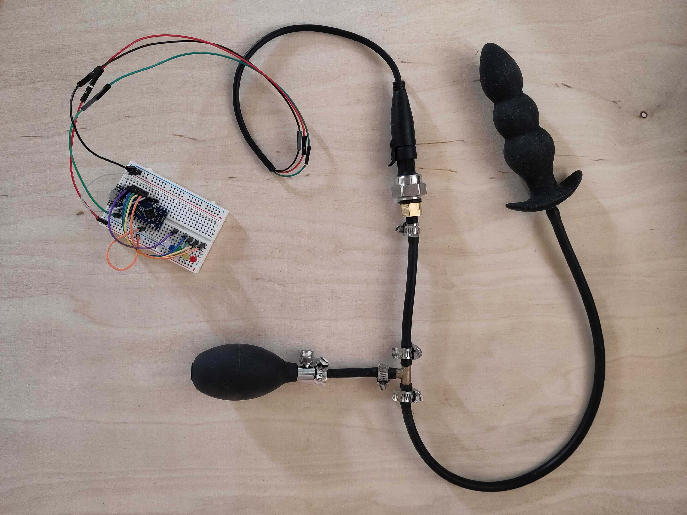

# Anal Contraction

The anal contraction measurement is component of the OrgasmTracker project that allows for the monitoring of anal muscle activity during orgasm.

Delving into the realm of sensory exploration, I've created a simple yet effective system for measuring vaginal or anal contractions. It features an inflatable plug linked to a pressure sensor, which in turn connects to an Arduino for analog readings of internal pressure. Currently, I'm using LEDs to visualize the pressure, but I'm considering a Raspberry Pi upgrade for more accurate monitoring integrating different things. The initial tests conducted on the subject @Olivinne during orgasm — induced through clitoral vibrations — yielded intriguing results. I forgot to record them of course.
